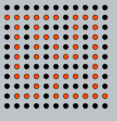
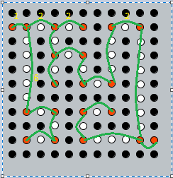
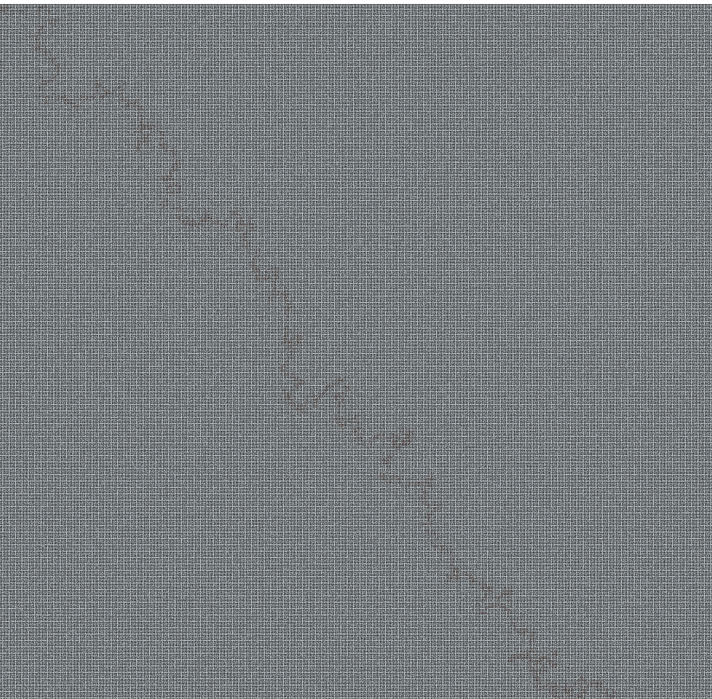
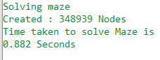
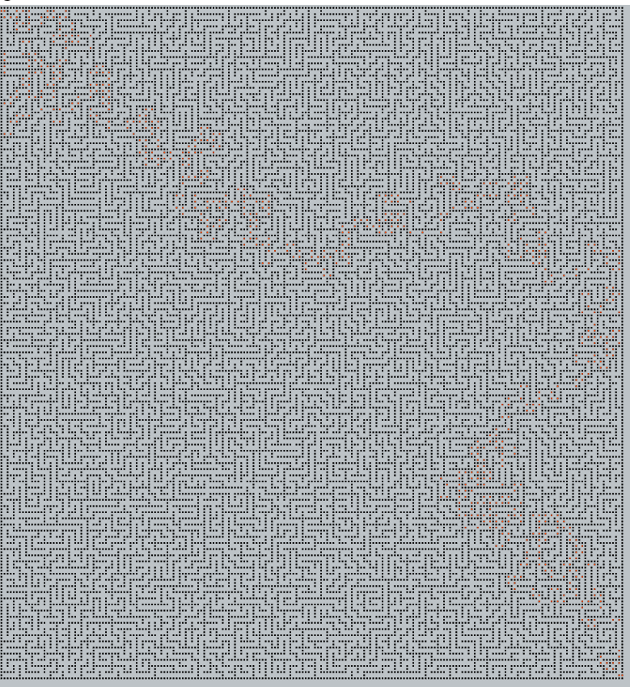
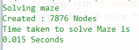

# Shortest path finder and maze solver written in `C++`

The code implements the Graph data structure, the ds uses the standared library `Set` to represent the edges [Adjacency relation] with other nodes in the graph.

The code also implements the method `void MazeSolver :: dijkstra()` that implements Dijkstra greedy algorithm.

The code is memory efficient when it comes to solving the maze by making sure that it does not create too much nodes, instead it only create nodes at the corners/end points with the proper weight between nodes.

### Example

Non efficient implementation

Where the **Orange** nodes are all the available nodes on the path, and the **Black** nodes are all the walls

An efficient implementation [Used by the code]

In a map with **1,000,000** white blocks the code only created almost **350,000** node instead of using them all in the graph this also leads to a smaller running time.

## Screenshots

A very big maze with almost **1,000,000** white nodes

The software solved this with only creating **350,000** nodes and in a time less than a second

A maze with **22,000** white nodes

The software solved this with only creating **8,000** nodes and in a time less than **0.02** second

